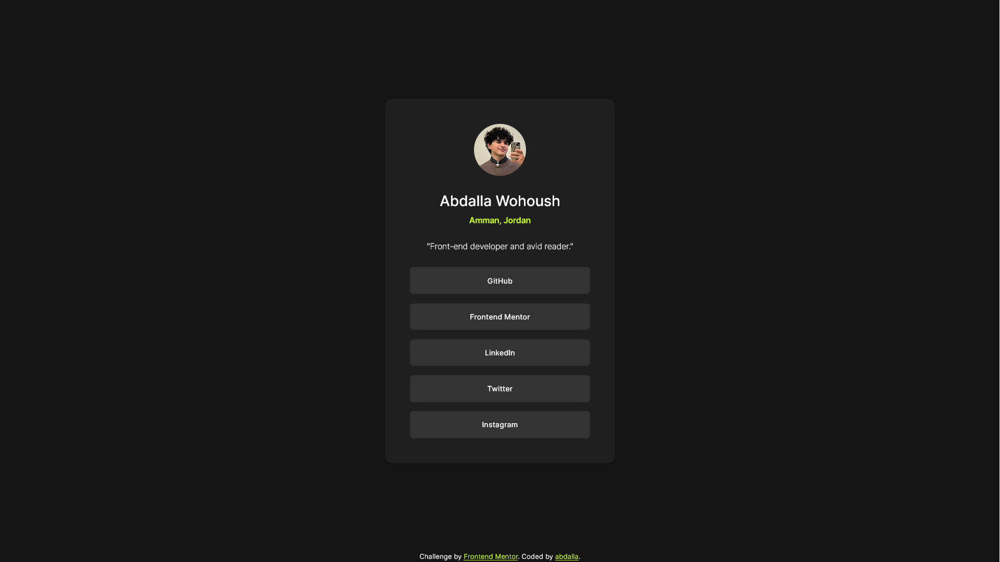

# Frontend Mentor - Social links profile solution

This is a solution to the [Social links profile challenge on Frontend Mentor](https://www.frontendmentor.io/challenges/social-links-profile-UG32l9m6dQ).

## Overview

### The challenge

Users should be able to:

- See hover and focus states for all interactive elements on the page

### Screenshot

### Links

- Solution URL: [Frontend Mentor](https://www.frontendmentor.io/solutions/social-links-preview-with-css-flexbox-GnQaKZxF67)
- Live Site URL: [Vercel](https://social-links-preview-card.vercel.app)

## My process

### Built with

- Semantic HTML5 markup
- CSS custom properties
- Flexbox

### What I learned

- The way I was importing fonts was wrong, instead of importing the file using `@import` I learned that the proper way was `@font-face`. I also found that using variable font files is easier to import. I've actually also found that they are so much easier to use due to the fact that you can assign a range of font weights in the declaration instead of redeclaring it multiple times to get the desired font weights, but the variable files come with the downside of being larger than the individual font files, so when the project is small and doesn't use many font files, then it would be better to use the indiviual font files instead.

### Continued development

- I would like to work on accessability and resizing elements based on screen sizes, as well as furthering my understanding of how parent divs interact with child content.
